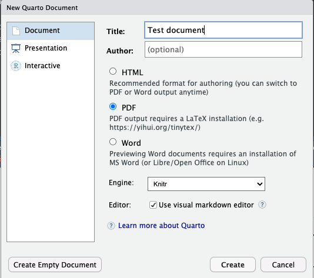
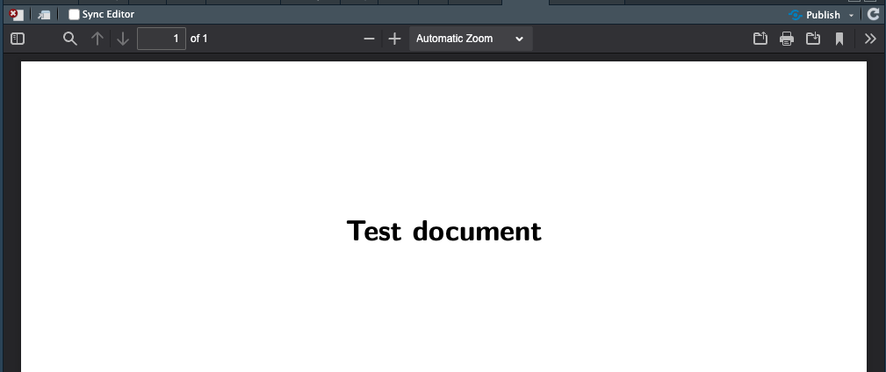

# Quintro

— 6 hour introduction to Quarto —

<!-- badges: start -->

[](https://github.com/drmowinckels/quartaki/actions/workflows/publish.yaml)
<!-- badges: end -->

There are increasing demands on scientific staff in preparing reports
for governmental and public dissemination, as well as scientific
dissemination. Creating reports is a time-consuming task, as it often
requires switching between programs for writing, doing analyses and
creating tables and figures, as well as other graphical and textual
programs. Learning efficient tools in combining programming and report
generation are becoming increasingly important to alleviate the manual
and burdensome process of switching programs. Quarto is a second
generation report framework based on the popular markdown plain text
format. Combining writing in markdown with the ability to run code to
format, analyse, and visualise data, all in the same place, creates a
seamless environment for the researchers to produce reports. While this
workshop will focus on using Quarto with R, it also has native abilities
to interact with python, observable.js and Julia, without needing R
installed. This makes Quarto a great tool to learn, no matter which
language you focus on.

> **Aims**
>
> -   Understand the basics of markdown
>
> -   Ability to generate html & pdf reports, and presentations
>
> -   Ability to cross-reference report content and add citations
>
> -   Be able to use Academic Journal templates

## Schedule

-   Elements of a qmd ( \~ 45 minutes)

-   Making our first html report ( \~ 45 minutes)

-   Citations & cross-references ( \~ 45 minutes)

-   Lunch ( \~ 60 minutes)

-   Making our first pdf report (\~ 45 minutes)

-   Testing journal templates ( \~ 45 minutes)

-   Making our first presentation ( \~ 45 minutes)

## Prepare

# Preparations

This introductory workshop to Quarto is being instructed using R and
RStudio. It would be easiest for learners to follow along, and the
instructor to help you , if you also use this set-up.

Install instructions can be found on the [Quarto
webpages](https://quarto.org/docs/get-started/).

> **Install summary**
>
> -   install/update [Quarto CLI](https://quarto.org/docs/get-started/)
>
> -   install/update [R](https://cran.rstudio.com/)
>
> -   install/update
>     [RStudio](https://posit.co/download/rstudio-desktop/)

A new version of RStudio and R is recommended. Quarto is in rapid
development, please make sure your RStudio is the newest version
available (which will also install newest Quarto) to be able to follow
along the workshop. Even if you have R, RStudio and Quarto installed on
your system, you should update all three before the workshop.

> **Using another setup**
>
> You may choose to use vscode or another IDE, or even to do python in
> stead of R. However, know that the instructor will be less available
> to help using these tools, and code examples will need to be thought
> of by the learners them selves. Some examples on using other set-ups
> than R and RStudio can be found on the [Quarto
> webpages](https://quarto.org/).

## R packages

In addition to Quarto, a series of R packages will also be needed to
show-case the ways we can use Quarto to generate reports.

``` r
# Run in R
install.packages(c(
  "tidyverse",     # data-wrangling
  "knitr",         # table printing
  "kableExtra",    # pretty table printing
  "palmerpenguins" # dataset
))
```

## Tinytex

When creating PDFs from Quarto, we need to have LaTeX installed for that
conversion to happen. To install tinytex, open your RStudio and look for
a tab called `Console` (by default it should be in the lower left
corner). Next to the console, there should be a tab called Terminal, and
run the following command:

``` bash
quarto install tinytex
```

> **I can’t see the terminal!**
>
> If the terminal is not visible next to the console, you need to enable
> it. Go to `Tools -> Terminal -> Move focus to Terminal` and it should
> pop up.

## Check the install

The best way to confirm that everything is installed correctly, is to
create a test quarto document. In RStudio, go to
`File -> New file -> Quarto document`

  

Fill in the title, and choose to create a PDF document (this will also
verify tinytex installation is successful). Click on `Create`.

RStudio should open a document for you, which is the test document you
will render. Don’t think about the content just now, but find the
`Render` button at the top of the document. Click it and you should see
some action in a new tab called “Background jobs”. It will call on latex
and maybe install some latex packages to create your document. If it is
successful, the RStudio Viewer window should come into focus and you
will see a preview of a PDF document with the title “Test document”.
This means everything went fine and you are ready!



## Troubleshooting

If you have problems getting things installed, please contact me [on
email](mailto:a.m.mowinckel@psykologi.uio.no) or through a [GitHub
issue](https://github.com/drmowinckels/quartaki/issues), and I will try
help you get sorted.

## Instructor’s notes

The sections of the workshop are intended to be run in sequence, as they
prepare the learners for the section coming. Changing the order of the
sections would also mean adapting content to make sure you don’t skip
ahead from where the learners are. In particular, the sections after
lunch have little presentation, but mostly live coding and working.

The [course website](https://drmowinckels.github.io/quartaki/) should
contain most of the materials for learners to follow along presentations
and the schedule.

The output examples are found in their [own folder](example_files/), and
have the entire code for the final outputs, after all parts of their
respective section has been covered.

In most cases, after the text and code chunks have been written, the
course focuses on adapting yaml settings for the different format types.

## Code of Conduct

Please note that the quartaki project is released with a [Contributor
Code of
Conduct](https://contributor-covenant.org/version/2/1/CODE_OF_CONDUCT.html).
By contributing to this project, you agree to abide by its terms.
